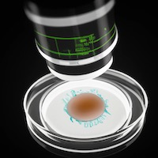

## OpenBLab

This is an open-source lab automation project.

Here's a 1000 words:

but automated.

Parts required:

* SBC e.g. [Raspberry Pi](https://rpilocator.com/)
* [Peltier device](https://s.click.aliexpress.com/e/_DBggz5V)
* [Temperature sensor](https://s.click.aliexpress.com/e/_DmMl93Z)
* [Camera](https://s.click.aliexpress.com/e/_DmQooUJ)

If using a 12V peltier device, you will also need
* [12V power supply](https://s.click.aliexpress.com/e/_DePtWNZ)
* [buck converter](https://s.click.aliexpress.com/e/_DDBOrqR)
