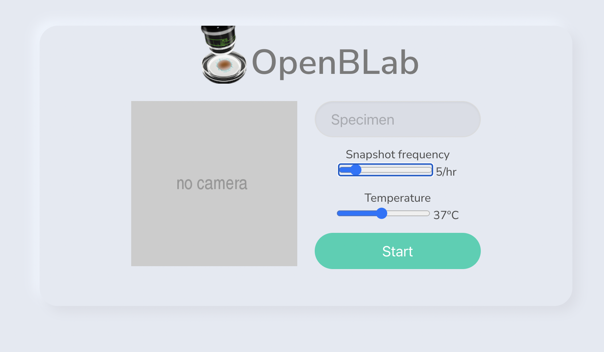

## OpenBLab


This is an open-source lab automation project.

The ideal process would be as follows, add a culture to the agar gel, set the temperature and frequency with which the camera should take snapshots, then press START. Monitor the progress remotely.

<br clear="both"/>

##

Parts required:

* SBC e.g. [Raspberry Pi](https://rpilocator.com/)
* [Peltier device](https://s.click.aliexpress.com/e/_DBggz5V) (5v or 12v)
* [Temperature sensor](https://s.click.aliexpress.com/e/_DmMl93Z)
* [Camera](https://s.click.aliexpress.com/e/_DmQooUJ)

If using a 12V peltier device, you will also need
* [12V power supply](https://s.click.aliexpress.com/e/_DePtWNZ)
* [buck converter](https://s.click.aliexpress.com/e/_DDBOrqR)

For the sample:
* [Agar plates](https://s.click.aliexpress.com/e/_DCe6UFd)

##

Example UI



##

Run API:

```
cd code/api 
pipenv install
pipenv run start:dev
```